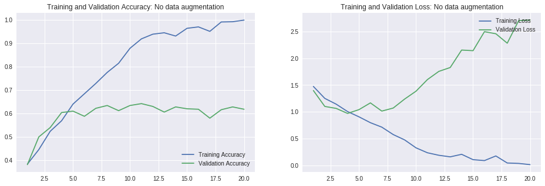
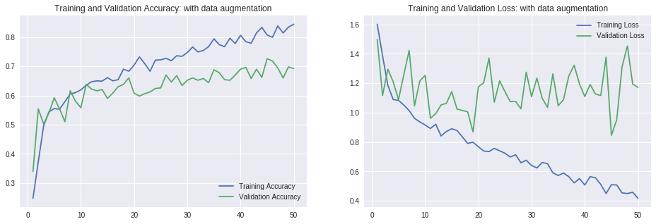
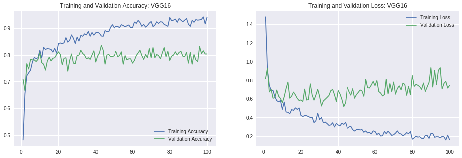
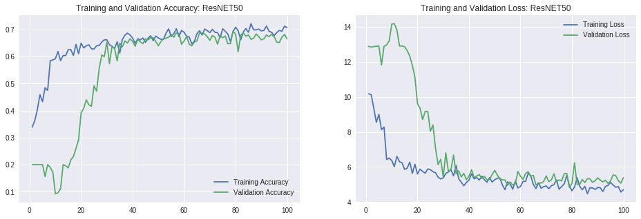
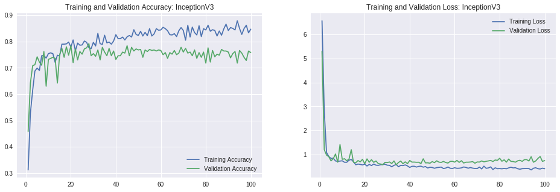
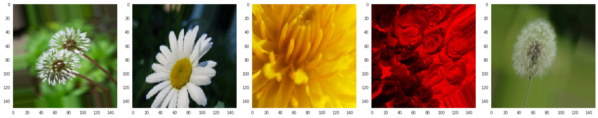

# Flower Recognition
Image Classification using a CNN on Flowers🌷

In this notebook, we will train a CNN-based image classifier to classify a couple thousand images of flowers, loaded from a directory on google drive.

We will compare three pretrained model: **VGG16, ResNet50, Inception**

The training will take **data augmentation**.

### Accuray comparasion:
* Convnet without data augmentation: 63%
* Convnet with data augmentation: 70%
* VGG: 80% **(Winner)**
* ResNet50: 67%
* InceptionV3: 75%

#### 1. CNN without data augmentation and pretrained model

* The model nearly overfitting at 5 epoch. 
* The avg accuracy is 62%

#### 2. CNN with data augmentation without pretrained model

* Accuracy: 70%

#### 3. VGG

* Accuracy: 80%

#### 4. ResNet50

* Accuracy: 67%

#### 5. Inception

* Accuracy: 65%

### Dataset

Let's take a look at some of the images

### conclusion
* **VGG16** converges quicker than **ResNet50**
* The training data and validation data of **VGG16** improves steadly, while **ResNet50** is hard to improve validation accuracy at first, but imporves quickly after a certain epoch
* The **InceptionV3** has very low loss but it's validation accuary still not improve
